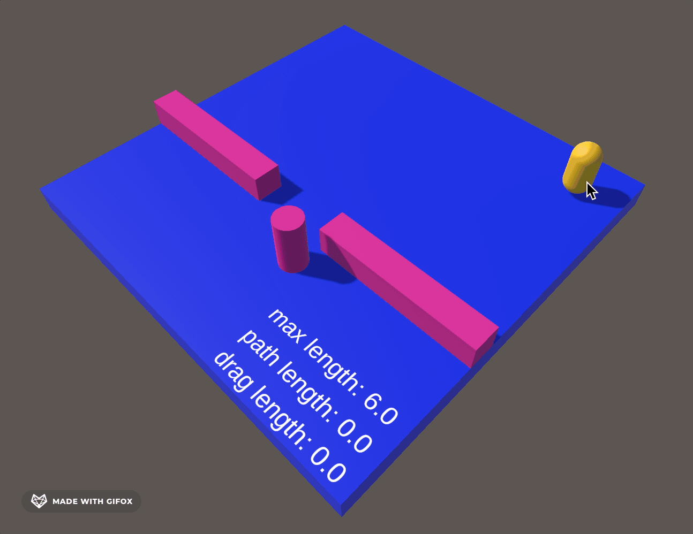

# Unity NavMeshPath Limiting

Library to limit the length of a `NavMeshPath` created by `NavMeshAgent` or any valid path represented by an array of Unity `Vector3` coordinates.

## Demo

Checkout the repository and import the project into Unity to play with below demo


## How to use?
Simply copy [`Path.cs`](Assets/Scripts/Path.cs) and [`NavMeshPathExtension.cs`](Assets/Scripts/NavMeshPathExtension.cs) to your project 

### NavMeshPath C# extension class
NavMeshPathExtension adds 3 helper methods to NavMeshPath: `Length`, `Limit` and `LimitFromEnd`

```csharp
using UnityEngine;
using UnityEngine.AI;
public class Demo : MonoBehaviour
{
    private void Start()
    {
        var target = Vector3.zero;
        var maxLength = 2.5f;
        var meshAgent = GetComponent<NavMeshAgent>();
        var calculatedPath = new NavMeshPath();
        if (meshAgent.CalculatePath(target, calculatedPath))
        {
             // calculates path length
            print(calculatedPath.Length());
             // limits path to a max length
            var limitedPath = calculatedPath.Limit(maxLength);
            foreach (var point in limitedPath)
            {
                print(point);
            }
            // limits path to a max length from end of path
            limitedPath = calculatedPath.LimitFromEnd(maxLength);
            foreach (var point in limitedPath)
            {
                print(point);
            }
        }
    }
}
```

### Path static class
If it is more convenient for you you can use [`Path.cs`](Assets/Scripts/Path.cs) class static methods directly
```csharp
using UnityEngine;
using UnityEngine.AI;
public class Demo : MonoBehaviour
{
    private void Start()
    {
        var target = Vector3.zero;
        var maxLength = 2.5f;
        var meshAgent = GetComponent<NavMeshAgent>();
        var calculatedPath = new NavMeshPath();
        if (meshAgent.CalculatePath(target, calculatedPath))
        {
            // calculates path length
            print(Path.Length(calculatedPath.corners));
            // limits path to a max length
            var limitedPath = Path.Limit(calculatedPath.corners, maxLength);
            foreach (var point in limitedPath)
            {
                print(point);
            }
            // limits path to a max length from end of path
            limitedPath = Path.LimitFromEnd(calculatedPath.corners, maxLength);
            foreach (var point in limitedPath)
            {
                print(point);
            }
        }
    }
}
```
## License

The code in this project is licensed under the MIT License. See [LICENSE](LICENSE) for details.
